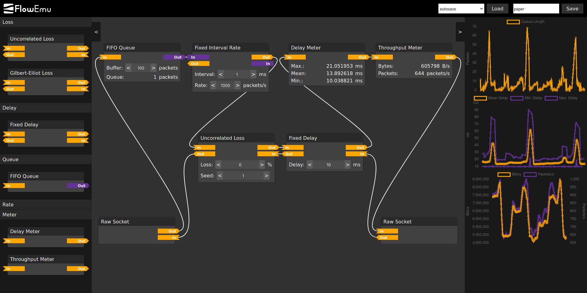

<div align="center">
	
	<br />
	<br />
	<b>Flow-Based Network Emulator</b>
	<br />
	<br />
	<p>
		<a href="#about">About</a>
		&thinsp;•&thinsp;
		<a href="#features">Features</a>
		&thinsp;•&thinsp;
		<a href="#getting-started">Getting Started</a>
		&thinsp;•&thinsp;
		<a href="#license">License</a>
		&thinsp;•&thinsp;
		<a href="#authors">Authors</a>
		&thinsp;•&thinsp;
		<a href="#publications">Publications</a>
	</p>
</div>

# About
FlowEmu is an open-source flow-based network emulator, which allows the user to model a communication system via freely connectable modules that implement different types of impairments, queues and departure processes.
It comes with a Python toolchain that supports running experiments in a virtual Docker environment or on a hardware testbed.
FlowEmu features a web-based Graphical User Interface (GUI) as well as a Message Queuing Telemetry Transport (MQTT) interface.
Via these interfaces, the user can change the structure and parameters of the model at runtime and get real-time statistics.

<div align="center">
	
</div>

# Features
 * Extendable set of freely connectable modules (see [Modules](#modules))
 * Written in C++
 * Runs on Linux as a single user space process
 * Access to Ethernet frames via raw sockets
 * Python toolchain for running experiments
 * Supports virtual Docker environments as well as hardware testbeds
 * Web-based Graphical User Interface (GUI)
 * Message Queuing Telemetry Transport (MQTT) interface
 * The structure and parameters of the model can be changed at runtime
 * Real-time statistics
 * Separate seedable pseudo random number generator for each module

### Modules
 * Loss:
    * Uncorrelated loss
    * Continuous-time Gilbert-Elliot model
    * Trace (compatible with [Link'Em](https://github.com/sys-uos/linkem))
 * Delay:
    * Fixed delay
    * Trace (compatible with [Link'Em](https://github.com/sys-uos/linkem))
 * Queues and Active Queue Management (AQM) algorithms:
    * FIFO
    * RED
    * CoDel
    * PIE
    * PI2
 * Rate limiters / departure processes:
    * Bitrate
    * Fixed interval
    * Trace (from [Mahimahi](http://mahimahi.mit.edu/))
 * Meters:
    * Delay
    * Throughput

# Getting Started
This guide shows you how to get started by setting up a development environment using Docker.
Even though **this guide is written for Ubuntu 20.04 LTS**, FlowEmu can be executed on any Linux distribution.
Please adapt the commands that are executed on the host system accordingly.

## Install prerequisites
Before we can start, you need to install some packages that are required on the host system:
```
sudo apt-get install pipenv ethtool mosquitto-clients
```

### Docker
As the development environment is based on Docker, you also need to install and set up Docker and Docker Compose:
```
sudo apt-get install docker.io docker-buildx docker-compose
```

Add your own user to the *docker* group, so you are able to control the Docker daemon:
```
sudo usermod -aG docker $USER
```

You have to log out and log in again for the group settings to take effect.

## Install and set up FlowEmu
Clone the FlowEmu repository and enter the directory:
```
git clone https://github.com/ComNetsHH/FlowEmu.git
cd FlowEmu
```

### Set up Python environment
FlowEmu comes with a Pipfile for Pipenv.
To set up a virtual environment for Python and install all dependencies, run the following command:
```
pipenv install
```

You can then upgrade pip and install the FlowEmu Python library using:
```
pipenv run pip install --upgrade pip
pipenv run pip install -e lib/python
```

### Install and start the MQTT broker
FlowEmu needs an MQTT broker, which also serves the GUI.
This can be started using Docker Compose and the following command:
```
docker-compose -f server/docker-compose.yml up -d
```

The Docker Compose file is set up to automatically start the broker on system boot.
If you want to stop it, run the following command in the root directory of the repository:
```
docker-compose -f server/docker-compose.yml down
```

Alternatively, you can run the broker in the foreground by omitting the `-d` option.

### Build and start FlowEmu
You can now execute the run script:
```
pipenv run ./run.py config/environments/docker
```

The script will build the Docker image, which includes compiling FlowEmu.
It then starts three Docker containers: *source, channel and sink*.
The emulator is executed in the *channel* container, while the *source* and *sink* containers can be used to start the application under test.
All Docker containers are connected by manually creating bridge interfaces between their network namespaces.
This is done instead of using native Docker networks, because the Docker networks have shown to not be suitable for using them with the emulator.

By default, the bridge network interface of the *source* container has the IPv4 address *10.0.1.1*, while the one of the *sink* container has the address *10.0.2.1*.
Both containers also use the FlowEmu Docker image, which can be changed in the configuration files in `config/environments/docker`.
As elevated privileges are required to use some TCP congestion control kernel modules, the *source* and *sink* containers are started in privileged mode.

The script runs multiple commands via *sudo*, so it will ask you for your password.
However, it only executes commands using *sudo* when necessary and does not do any permanent changes on your system configuration.

If you want to stop FlowEmu, just press `Ctrl + C` in the terminal.
This will gracefully shut down everything.

## Run your first experiments

### Access the GUI
The GUI is served by the MQTT broker via HTTP on port 9001.
As the MQTT broker is running on your local machine, you can access the GUI at: http://localhost:9001/

### Create a simple channel model
By default, there is no connection between the two interfaces of the emulator.
Therefore, you have to connect the two *raw socket* modules by clicking on one of their ports and then create a connection by clicking on the contrary port of the other module.
Repeat this step for the other direction.

### Ping
To see whether the connection was established successfully, you can run the *ping* command in the *source* container to send ICMP ping packets to the *sink* container.
To do so, run the following command in a separate terminal:
```
docker exec -it source ping 10.0.2.1
```

If you now see the responses from the *sink* container in the terminal output, you have successfully set up the emulator.
It is now time to start playing around with the GUI and observe the effects of the different modules on the round-trip time and packet loss.

### iPerf
If you want to measure throughput, you can use iPerf.
Run the following commands in separate terminals to execute the iPerf server in the *sink* container and the iPerf client in the *source* container:
```
docker exec -it sink iperf -s
```
```
docker exec -it source iperf -c 10.0.2.1 -t 30 -Z cubic
```

After 30 seconds, you will see the measured throughput in the command line output.

#### Changing the TCP congestion control algorithm
The TCP congestion control algorithm can be set via the `-Z` option.
As iPerf will use the kernel modules of the host's kernel, you can only use the currently loaded modules.

To get a list of all TCP congestion control kernel modules that can be loaded, execute the following command on the host system:
```
ls -l /lib/modules/$(uname -r)/kernel/net/ipv4/tcp_*
```

To load a specific TCP congestion control kernel module, run for example:
```
sudo modprobe tcp_bbr
```

The module can then be used in iPerf by using `-Z bbr`.

# License
FlowEmu is licensed under the [GNU General Public License v3.0](COPYING) or later.

# Authors
 * [Daniel Stolpmann](https://github.com/dstolpmann), Hamburg University of Technology, Institute of Communication Networks, Germany - <daniel.stolpmann@tuhh.de>

# Publications
 * [D. Stolpmann and A. Timm-Giel, “FlowEmu: An Open-Source Flow-Based Network Emulator,” Electronic Communications of the EASST, vol. 80: Conference on Networked Systems 2021 (NetSys 2021), Sep. 2021](https://doi.org/10.14279/tuj.eceasst.80.1141)
